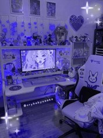

<html lang="en">
  <head>
    <!-- Google tag (gtag.js) -->

    <meta charset="UTF-8">
    <meta name="viewport" content="width=device-width, initial-scale=1.0">
    <meta http-equiv="X-UA-Compatible" content="ie=edge">
    <title>Seeking Aesthetic | Blog</title>
    <meta name="description" content="Aesthetic gaming setup tips and essentials.">
    <meta name="keywords" content="gaming, setup, aesthetics, essentials, gaming room">
    <meta name="author" content="Sophia Cong">
    <meta charset="UTF-8">
    <meta name="viewport" content="width=device-width, initial-scale=1.0">
    <link rel="stylesheet" type="text/css" href="css/panel.css">
    <link rel="stylesheet" type="text/css" href="css/home.css">
  </head>
  <body>
    <header>
      

        
        <nav>
          <button class="nav-button" onclick="window.location.href='home.html';">Home Page</button>
          <button class="nav-button" onclick="window.location.href='startingup.html';">Starting Up</button>
          <button class="nav-button" onclick="window.location.href='essentials.html';">Essentials</button>
          <button class="nav-button" onclick="window.location.href='space.html';">Space</button>
          <button class="nav-button" onclick="window.location.href='blog.html';">Blog</button>
        </nav>
      

      <h3 class="blog-title">Sophia Cong | 2/20/2024 | Assignment Title</h3>
    </header>

    <main>
      

        
        <article class="article">For those deeply invested in gaming, the aspiration for the ultimate PC gaming setup is often a
          priority. Such an arrangement not only optimizes gameplay but also promotes better health,
          well-being, relaxation, and overall enjoyment during gaming sessions. A top-tier gaming setup
          ensures that players are equipped with the necessary tools and environment conducive to their
          gaming endeavors, ultimately enhancing their gaming experience to its fullest potential.
           
           
          The atmosphere of your gaming space plays a crucial role in enhancing your entire gaming
          experience. When designed to align with your personal preferences, it can significantly elevate
          your environment. From the layout of your desk to the lighting scheme, there are numerous
          aspects to consider in creating the perfect gaming setup. Comfortable seating, ergonomic
          peripherals, and an organized layout can all contribute to a more immersive and enjoyable
          gaming session. Whether you prefer a minimalist aesthetic or a more vibrant ambiance, tailoring
          your gaming space to suit your tastes can greatly enhance your overall satisfaction while
          gaming.</article>
      

      
  

      

        

          
          
Sponsor 1

        

        

          
          
Sponsor 2

        

        

          
          
Sponsor 3

        

      

      
  

      

        <h2>Directory</h2>
        

          
<a href="startingup.html">Starting Up</a>

          <ul>
            <li>Personal Aspect of a Set Up</li>
          </ul>
        

        

          
<a href="essentials.html">Essentials For a Set Up</a>

          <ul>
            <li>Computer
                <ul>
                    <li>PC Parts</li>
                </ul>
            </li>
            <li>PC accessories
              <ul>
                  <li>Keyboards</li>
                  <li>Mice</li>
                  <li>Mics</li>
                  <li>Headsets</li>
                  <li>Mouse/Desk Pads</li>
                </ul>
              </li>
              <li>Other Accessories
                <ul>
                  <li>Cameras</li>
                  <li>Sound bars</li>
                  <li>Headset stands</li>
                  <li>Lights</li>
                </ul>
              </li>
            </ul>
        

        

          
<a href="space.html">Space</a>

          <ul>
            <li>Desk</li>
            <li>Chair</li>
            <li>Storage</li>
            <li>Organization</li>
            <li>Clutter</li>
          </ul>
        

        

          
<a href="blog.html">Blog</a>

          <ul>
            <li>Share Your Ideas</li>
            <li>Questions</li>
          </ul>
        

      
      
    </main>
    
    <footer>
      
Footer...

    </footer>
  </body>
</html>
